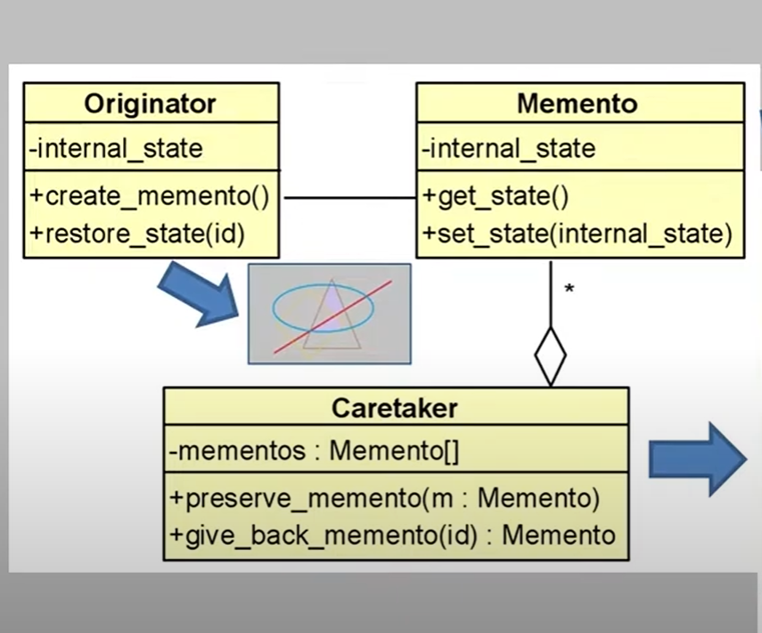

# **Estrutura Memento** 

## Apresentado por:
- João Angra, 
- Steffany;

# O que é:
- O Memento é um padrão comportamental que permite capturar e armazenar o estado interno de um objeto **sem expor sua implementação**. Ele oferece uma forma de **salvar o estado de um objeto** em um momento específico e/ou depois **restaurá-lo** a esse ponto no futuro. 
1. O memento possui 3 classes, uma dessas sendo um objeto.
2. O principal conceito tratado pela situação do memento é o estado. O estado:
- É  uma situação que o sistema se encontra durante sua operação.
3. Esse padrão é útil quando precisamos salvar o estado atual de um objeto e, em algum momento posterior, restaurá-lo para aquele estado, sem que os detalhes internos desse estado sejam expostos ou alterados diretamente .

## Estado do ***Objeto***
- O estado de objeto é uma situação, ele é definido pelos valores de seus atributos (são os valores de um atributo, de um objeto que define um estado que esse objeto se encontra).

## Diagrama - Memento

